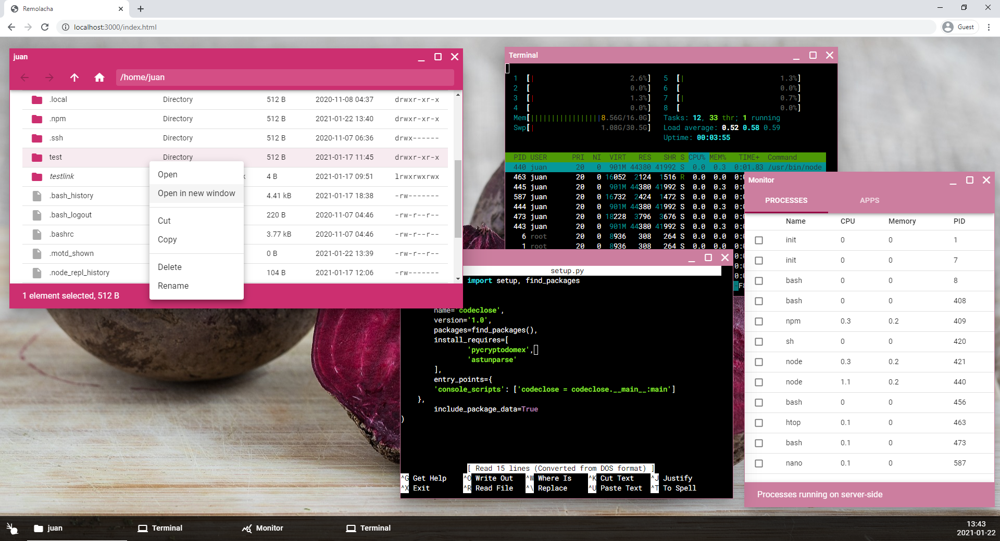

# Remolacha

## A web desktop environment for remote servers

The goal of this project is to offer a graphical environment and a small set of applications for administrating remote servers easily (terminal, file manager, text editor, etc).

The advantage of this in front of VNC or remote X is that the server load is almost non-existent, as applications run on Javascript—on the client side—and only call certain microservices when necessary.



## Build \& run

Download this repository and run the following commands in its root:

```bash
$ bash build.sh
[...]

$ bash start.sh
```

This will set up an HTTP server in port 3000, making Remolacha available for anyone who connects to it.

## Caution

This project is in a very early development stage. It is not safe to use it in a production environment, since

* it does not require login,
* it uses WebSockets for communicating with the backend (and WebSockets do not follow SOP and CORS policies, so it is vulnerable to XSS attacks), and
* it has not been properly tested and reviewed yet.

These problems will be eventually solved, but until then it is not recommended to use Remolacha to handle sensitive information.
